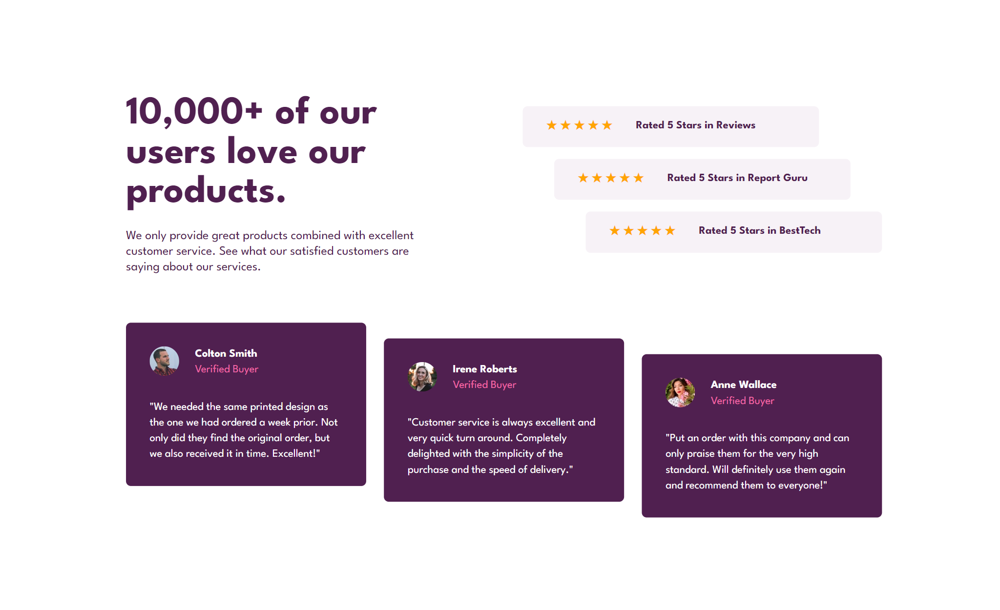

# Stats Preview Card

## Bem vindo! 👋

Obrigado por verificar meu projeto front-end.

Estou constantemente aprimorando minhas habilidades em HTML e CSS para evoluir o nível dos meus projetos.

## Objetivo do Projeto

Neste projeto eu optei por fazer uma pagina com comentarios e avaliações de usuários com um estilo mais desalinhado para dar um tchã! 
Dessa vez eu gostaria de refinar as minhas habilidades com o Flexbox, então escolhi um projeto o qual eu já percebi logo que ele me ajudaria na parte de desenvolver o designe responsivo. Com isso foi necessário menos trabalho e ajustes utilizando o CSS juntamente ao HTML bem estruturado. 
Com o prazo de uma semana eu pude concluir o objetivo com poucas horas ao dia.

## Designe do Projeto

O designe tem diferentes espaçamentos entre as seções para o layout em desktop. Com mais espaço na tela foi bacana construir divisões assimetricas para deixar de lado padrões comuns e experimentar um pouco de bagunça (com ordem em tudo rsrs).

Aqui você pode ver uma prévia deste projeto visto por uma tela de desktop, o que significa que é uma largura mínima de tela de 1024px:

  

E esta é uma prévia de uma tela de celular (com largura de tela menor que 1024px):

  

## Estrutura do projeto

>Primeiro passo, estruturar o arquivo index.html de forma semantica como boas praticas; 
>Segundo, buscar as fontes utilizadas em https://fonts.google.com/ e declarar no cabeçalho assim também como as paginas de estilo reset.css e style.css; 
>Terceiro, começar a estilização da pagina pelo style.css a partir da estratégia "Mobile First"; 
>Quarto, implementar o display responsivo para desktop a partir de 1024px; 
