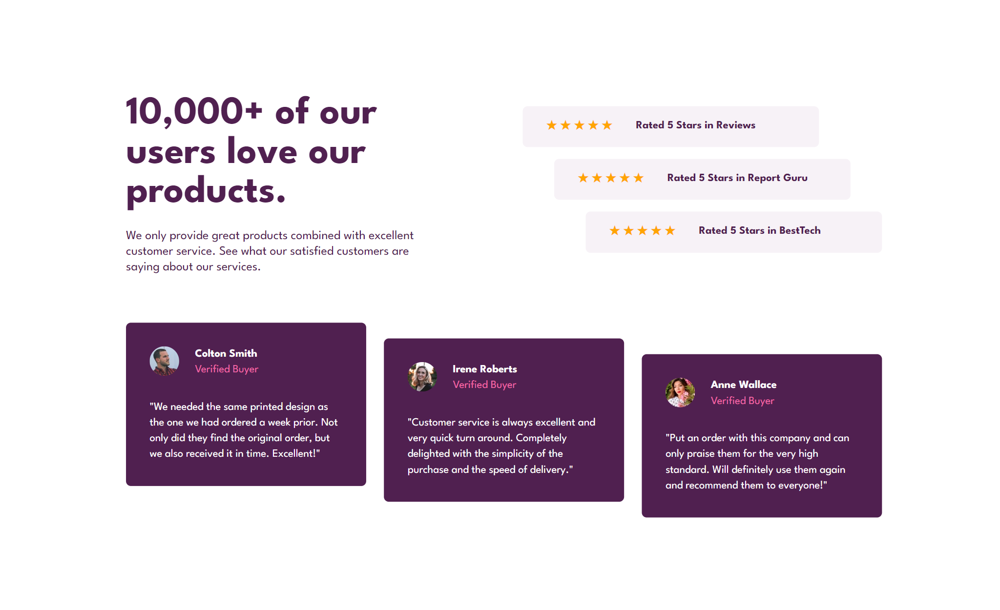

# Desafio Stats Preview Card

Uma página para destaques de experiências de usuários é muito importante para qualquer serviço ou produto online. Por este motivo, e pela escolha das ferramentas que precisaria para este projeto, escolhi aceitar este desafio.

## Objetivo

O intuito deste projeto é testar e aprimorar as habilidades em HTML e CSS. Para a realização deste objetivo as seguintes técnicas foram utilizadas:
 - Estrutura HTML semantica: Facilitando ao computador a compreenção da estruturação do projeto;
 - Responsividade: Layouts ajustaveis para mobile e desktop;
 - Estilização com CSS FlexBox: Tornando a realização dos layouts mais simples, prática e bem feita.

## Resultado do Projeto

Aqui você pode ver uma prévia deste projeto visto por uma tela de desktop, o que significa que é uma largura mínima de tela de 1024px:

  

E esta é uma prévia de uma tela de celular (com largura de tela menor que 1024px):

  

## Aprendizados

Com a experiencia deste projeto eu pude colocar em pratica o que aprendi sobre CSS FlexBox e entender como ele facilita o trabalho que tive para desenvolver o layout responsivo além de facilitar o posicionamento de cada elemento.

Utilizei uma folha de estilo "reset.css" para evitar alterações padrão de navegadores.

Apliquei a técnica de "mobile first", priorizando o layout para dispositivos mobile e ajustando para dispositivos desktop.

## Referência
 
 - Este é um desafio proposto por [Front End Mentor](www.frontendmentor.io).
 - O [Front End Mentor](www.frontendmentor.io) apenas oferece uma amostra do resultado esperado e o material para realizá lo.
 - Não há instruções ou dicas de como realizar o desafio, deixando toda e qualquer decisão a critério de quem o realiza.

## Autor

### Israel Carneiro de Oliveira
 
<table border: none;" border="0" cellpadding="0">
 <td>
  
 </td>
 <td>
  <h4>Contatos</h4> 
   
   
  <a href="https://www.frontendmentor.io/profile/Israel-Carneiro" target="_blank"><a>
 </td>
</table>
